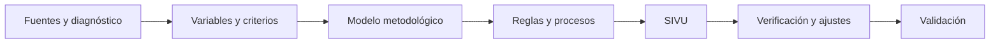
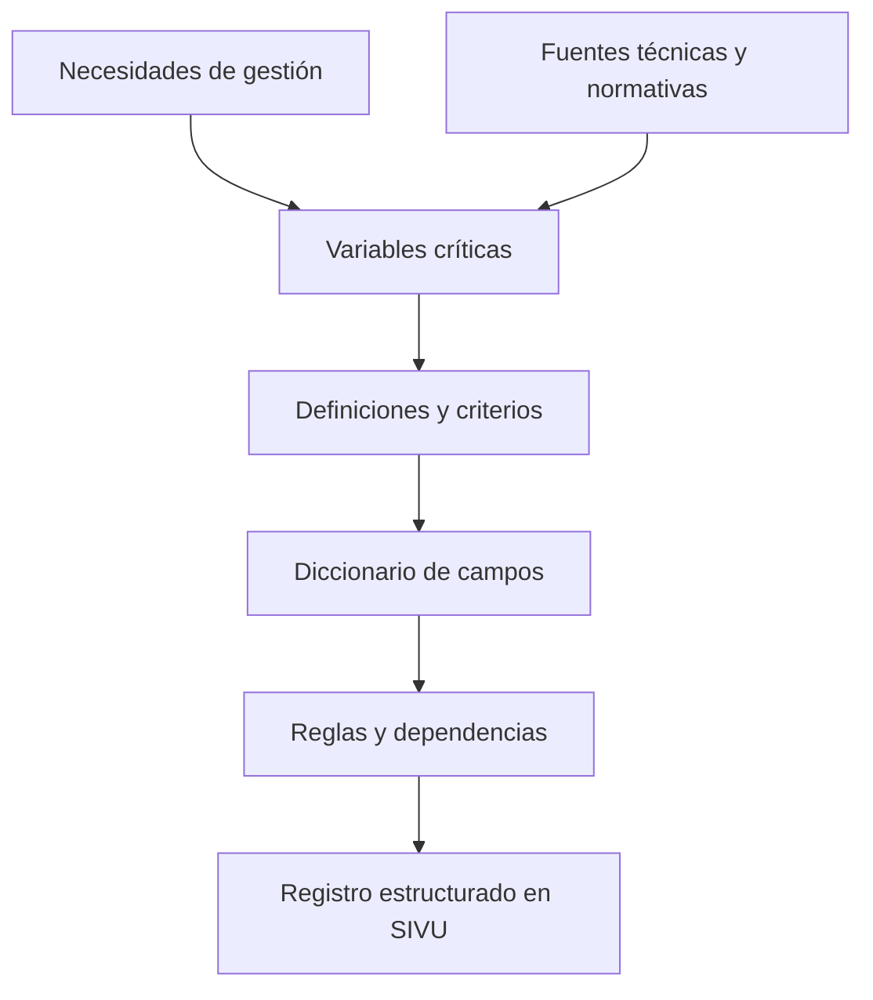
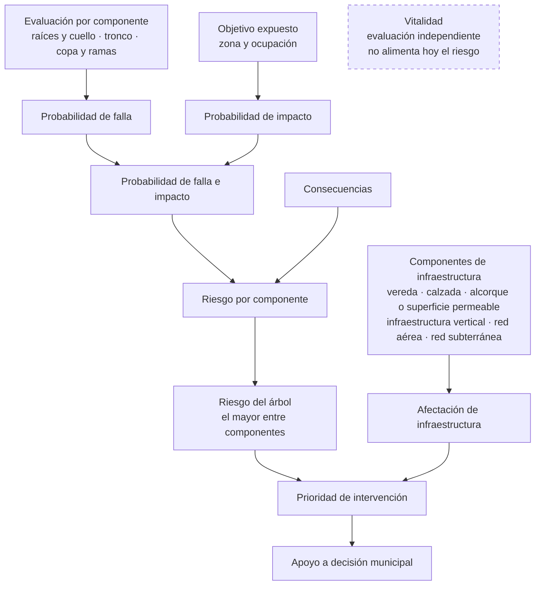
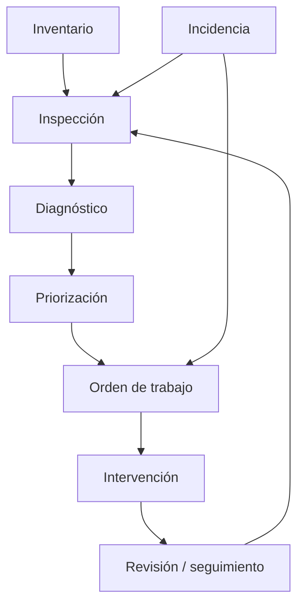
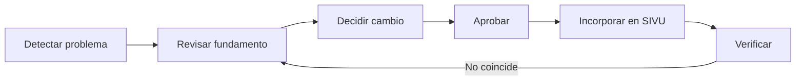
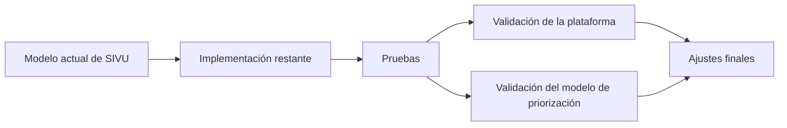

# Evolución y desarrollo de SIVU

> **Idea rectora:** este documento debe demostrar cómo evolucionó el
> modelo de SIVU, por qué se tomaron sus principales decisiones y cómo
> se aseguró que el desarrollo asistido por IA fuera consistente con la
> metodología del estudio.

Este documento no busca describir exhaustivamente el software
implementado. Su propósito es conservar la trazabilidad de las
decisiones que transformaron el estudio en una herramienta aplicable a
la gestión municipal del arbolado urbano y su interacción con la
infraestructura gris.

---

## 1. Cómo evolucionó SIVU

El ciclo de gestión estuvo presente desde el diagnóstico del estudio:
**inventario → diagnóstico → planificación → ejecución → mantenimiento y
monitoreo**. La reunión con el municipio lo confirmó. La información
disponible estaba fragmentada, la gestión era principalmente reactiva y
había poca trazabilidad de lo realizado. El municipio necesitaba decidir
qué árboles inspeccionar o intervenir, dónde actuar primero y registrar
qué se hizo después.

Lo que evolucionó durante el desarrollo no fue la idea del ciclo, sino
su **formalización y operacionalización**: definir con precisión qué
información se registra, cómo se transforma en una clasificación, cómo
esa clasificación se convierte en una acción y cómo se sigue esa acción.

**Inventario → evaluación → riesgo e infraestructura → priorización →
intervención → seguimiento → gestión territorial.**

| Planteamiento inicial | Cómo quedó en SIVU |
|---|---|
| Ficha del árbol | Árbol como unidad de gestión con historial |
| Evaluación puntual | Evaluaciones sucesivas |
| Diagnóstico técnico | Diagnóstico vinculado a decisiones |
| Árbol individual | Árbol + infraestructura |
| Resultado de evaluación | Priorización de intervención |
| Ubicación como dato del registro | Lectura territorial mediante SIG |
| Registro de condición | Seguimiento de acciones |

> **Decisión clave — El diagnóstico no debía ser el final del proceso.**
>
> La información levantada debía continuar hacia priorización,
> intervención y seguimiento. Formalizar ese recorrido convirtió el
> inventario en la base de un ciclo de gestión y no en un registro
> aislado.

> **Para defender:** el ciclo de gestión no se agregó al final. Estaba en
> el diagnóstico y en las necesidades del municipio; el trabajo
> posterior consistió en volverlo operable.

---

## 2. Cómo se construyó y formalizó la metodología

Las variables de SIVU no se definieron únicamente para completar
formularios digitales. Su construcción partió de fuentes técnicas y
normativas, del diagnóstico de necesidades de gestión y de la definición
progresiva de los componentes a evaluar.

Al transformar las variables en un procedimiento operable apareció una
exigencia adicional: cada campo debía tener un comportamiento
inequívoco. Para cada variable fue necesario definir, según
correspondiera, qué significa, quién la registra, cómo se obtiene, si es
obligatoria o condicional, qué activa su registro, de qué depende, qué
valores admite y si participa en una clasificación.

El diccionario de campos surgió para formalizar estas respuestas.

> **Hallazgo — "No aplica" no equivale a "No determinado".**
>
> "No aplica" indica que el campo no corresponde, por ejemplo, porque el
> elemento no existe junto al árbol. "No determinado" representa
> información que sí corresponde evaluar, pero que no pudo resolverse
> con los antecedentes disponibles. Ninguno de los dos debe confundirse
> con "sin daño".

> **Hallazgo — Registrar no equivale a calcular.**
>
> Se distinguieron antecedentes **observados**, **estimados** y
> **calculados** para separar lo que registra el inspector de lo que
> deriva de una regla.

> **Decisión clave — Un resultado calculado no se edita manualmente.**
>
> Una clasificación debe poder explicarse a partir de sus datos de
> entrada y de la regla que la produjo. Si se modificara a mano, se
> rompería esa trazabilidad. Cuando un resultado no representa la
> realidad, se revisan los datos o la regla; no se sobrescribe el
> resultado. Al revisar el modelo se detectaron campos de riesgo y
> prioridad que se ingresaban manualmente en paralelo a los calculados;
> su función está en revisión.

Así se consolidó la secuencia **dato levantado → procesamiento →
resultado → decisión de gestión**.

> **Para defender:** el diccionario no es solo un formulario. Estandariza
> qué significa cada variable, cómo debe registrarse y bajo qué condiciones,
> reduce interpretaciones diferentes y permite reconstruir los resultados
> desde sus datos.

---

## 3. Cómo se llega desde la evaluación hasta la priorización

Uno de los cambios centrales fue separar conceptos que podían
confundirse. SIVU no trata el riesgo del árbol, la afectación a
infraestructura y la prioridad de intervención como sinónimos.

El riesgo sigue la lógica de evaluación de riesgo de la ISA: no basta
con que una parte del árbol pueda fallar; importa también si al fallar
alcanzaría a un objetivo (personas, vehículos, bienes) y qué
consecuencias tendría.

| Resultado | Pregunta que busca responder |
|---|---|
| Riesgo | ¿Qué nivel de riesgo presenta el árbol según la evaluación definida? |
| Afectación | ¿Qué nivel de conflicto existe con la infraestructura? |
| Prioridad | ¿Con qué urgencia debería gestionarse la intervención? |

> **Decisión clave — Prioridad ≠ riesgo.**
>
> Existen afectaciones de la interacción árbol–infraestructura que
> comprometen infraestructura municipal, movilidad o seguridad sin
> depender de una eventual falla estructural del árbol. Por eso el
> riesgo y la afectación se evalúan por separado, y la priorización los
> integra para ordenar los casos según la urgencia de actuación, sin
> sustituir la evaluación del riesgo.

> **Para defender:** la prioridad no depende únicamente del riesgo del
> árbol; también incorpora la afectación a infraestructura y permite
> considerar conflictos que requieren gestión aunque no deriven de una
> eventual falla estructural.

> **Estado:** las matrices de riesgo, afectación y priorización están
> definidas en el modelo metodológico, en una versión en preparación.
> Todavía no están implementadas en la plataforma ni validadas. Su
> versión final debe mantener la trazabilidad entre entradas, reglas y
> resultado, y validarse junto con la plataforma.

---

## 4. Cómo el diagnóstico se transforma en gestión municipal

Una vez definido el diagnóstico apareció una pregunta distinta: **¿qué
ocurre después de clasificar un árbol?**

Las órdenes de trabajo vinculan una necesidad detectada con una acción
posterior y permiten registrar lo que el municipio identificó como
necesario: tipo de actuación, responsable, motivo, evidencia y estado
posterior del ejemplar. Las incidencias complementan el ciclo al
incorporar situaciones que no necesariamente provienen de una
inspección programada.

### Decisión: conservar evaluaciones sucesivas

- **Alternativa descartada:** actualizar la ficha del árbol con cada
  nueva evaluación.
- **Problema:** la condición de un ejemplar cambia en el tiempo y
  sobrescribir la ficha haría perder su evolución.
- **Decisión:** cada evaluación se conserva como un registro propio
  asociado al árbol.
- **Consecuencia:** se puede relacionar condición, decisión,
  intervención y reevaluación.

> **Para defender:** sin historial no es posible saber si una
> intervención mejoró la condición del árbol ni respaldar una decisión
> tomada en el pasado.

### Evolución de responsabilidades

Al operacionalizar el ciclo se hicieron visibles responsabilidades
diferentes: administrar los proyectos y sus usuarios, registrar el
inventario y solicitar acciones, evaluar técnicamente los árboles, y
ejecutar o revisar el mantenimiento. La distribución de esas
responsabilidades entre perfiles ha cambiado durante el estudio. Primero
se separó la captura municipal de la evaluación técnica; posteriormente
surgió una propuesta de cuatro perfiles: administrador, usuario
municipal, inspector y encargado de mantención.

> **En consolidación:** el número y el alcance definitivos de los
> perfiles siguen abiertos, incluida la posibilidad de que el usuario
> municipal y el inspector correspondan a un mismo perfil. La definición
> final debe coincidir con lo que la plataforma permite a cada persona.

> **Para defender:** lo estable no es la cantidad de perfiles, sino la
> separación de responsabilidades: quien registra, quien evalúa y quien
> ejecuta no cumplen la misma función en el ciclo.

> **Organización por proyectos**
>
> Cada proyecto agrupa una gestión o un inventario de arbolado de una
> institución, con su propio equipo. Esto permite mantener separados
> levantamientos distintos y, dentro de cada uno, organizar los árboles
> por espacio público o sector.

### Del árbol individual al territorio

La incorporación del SIG responde a las necesidades de gestión
identificadas en el diagnóstico municipal: visualizar la ubicación, la
condición, el riesgo, los conflictos y las intervenciones, y reconocer
**dónde** se concentran los problemas para priorizar territorialmente.

**Coordenadas → localización → representación espacial → lectura
territorial → apoyo a la gestión.**

> **[INSERTAR CAPTURA: mapa de inventario por proyecto en SIVU]**

El SIG representa territorialmente la información del modelo; no
reemplaza las reglas metodológicas ni calcula por sí mismo las
clasificaciones.

> **Para defender:** el mapa no es una segunda base de datos. Muestra la
> misma información del modelo para leerla en el territorio.

---

## 5. Cómo se materializó el modelo mediante desarrollo asistido por IA

En el estudio la IA aparece con dos usos distintos:

| Uso | Función | Estado |
|---|---|---|
| IA en el levantamiento fotográfico | Componente del objetivo general del estudio | Previsto |
| IA en el desarrollo de SIVU | Apoyo para traducir las especificaciones metodológicas a una herramienta digital | En uso |

Esta sección trata solo el segundo uso.

Las fuentes, variables, criterios, reglas y decisiones metodológicas
permanecen bajo responsabilidad de la investigación. La IA no define ni
modifica de forma autónoma umbrales, categorías ni reglas, y no
participa en el cálculo de las clasificaciones: estas se obtienen con
reglas explícitas y reproducibles.

**Investigadora:** define y revisa fuentes, variables, criterios,
relaciones, reglas, cambios aceptados y comportamiento esperado.

**IA:** apoya la materialización digital de las especificaciones y
tareas de desarrollo y revisión.

**Verificación:** contrasta lo implementado con las especificaciones
metodológicas y corrige inconsistencias antes de aceptar un cambio.

Cada cambio al modelo sigue el mismo recorrido:

La decisión y la aprobación corresponden a la investigación. La IA
interviene principalmente al incorporar el cambio en SIVU y al apoyar su
verificación. Se estableció un procedimiento para registrar los cambios metodológicos,
de modo que es posible identificar los criterios asociados a los resultados
obtenidos bajo cada versión del modelo.

> **Criterio de consistencia:** la pregunta relevante no es qué
> tecnología produjo una función, sino si el comportamiento implementado
> representa correctamente la metodología definida.

Además, la implementación funcionó como instancia de auditoría: al
exigir reglas explícitas sobre activación, obligatoriedad, dependencias,
cálculos y responsabilidades, hizo visibles ambigüedades y
contradicciones que podían permanecer ocultas entre diagramas, tablas y
documentos.

> **Para defender:** la IA ayudó a construir la herramienta, pero no
> decidió la metodología. Cada cambio fue revisado, aprobado y
> verificado contra las especificaciones del estudio.

---

## 6. Decisiones principales, estado actual y validación pendiente

### Decisiones que transformaron el modelo

| Punto de partida | Problema detectado | Decisión |
|---|---|---|
| Ciclo de gestión planteado conceptualmente | Faltaba volverlo operable | Formalizar priorización, órdenes de trabajo, intervención y seguimiento |
| Alternativa de actualizar la ficha | Se perdería la evolución temporal | Conservar evaluaciones sucesivas |
| Variables como campos | Existían criterios implícitos | Formalizar diccionario, dependencias y reglas |
| Resultado modificable | Juicios paralelos al cálculo y pérdida de trazabilidad | Resultados calculados no editables |
| Resultado único | Riesgo e infraestructura representan fenómenos distintos | Mantener dimensiones separadas e integrarlas en la priorización |
| Responsabilidades poco diferenciadas | El ciclo exigió distinguir funciones | Distribuir responsabilidades entre perfiles (en consolidación) |
| Ubicación como dato del registro | Faltaba lectura territorial | Incorporar SIG |
| Metodología documental | Persistían ambigüedades operativas | Convertirla en especificaciones verificables |

### Estado del desarrollo al 5 de octubre de 2026

**Implementado**

- Organización por proyectos y control de acceso.
- Primer mapa de inventario por proyecto.
- Estructura inicial para continuar integrando el modelo metodológico.

**Diseñado en el modelo metodológico o estructurado para implementación**

- Diccionario de variables.
- Evaluación por componentes.
- Riesgo, afectación de infraestructura y priorización (versión en
  preparación).
- Historial de inspecciones.
- Órdenes de trabajo, mantenimiento e incidencias.

**Propuesto / no consolidado**

- Indicadores de estructura y diversidad del arbolado. Los indicadores
  climáticos surgidos del diagnóstico no forman parte del conjunto
  actual.
- Participación comunitaria en el reporte de incidencias.

**Pendiente de consolidación o validación**

- Perfiles definitivos y distribución de responsabilidades.
- Aspectos abiertos de vitalidad y reglas asociadas.
- Revisión final de reglas y clasificaciones pendientes.
- Implementación completa de los módulos diseñados.
- Validación de SIVU.
- Validación del modelo de priorización.

El aporte esperado de SIVU no reside únicamente en digitalizar fichas.
Busca conectar información técnica, interacción con infraestructura,
priorización, acciones y seguimiento dentro de un mismo modelo de
gestión.

La validación final deberá comprobar tanto la utilidad y coherencia de
la plataforma como la capacidad del modelo de priorización para
representar los criterios definidos en el estudio.

---

# Anexo — Banco de decisiones para defensa

> Este anexo funciona como guía de estudio y puede mantenerse fuera de
> la versión final de la tesis.

| Si me preguntan... | Idea que debo poder defender |
|---|---|
| ¿Por qué SIVU no quedó como inventario? | El ciclo de gestión estaba en el diagnóstico y en las necesidades del municipio; el trabajo fue volverlo operable conectando evaluación, prioridad, intervención y seguimiento. |
| ¿Por qué conservar evaluaciones anteriores? | Porque la condición cambia y sobrescribir registros elimina trazabilidad. |
| ¿Por qué un diccionario tan detallado? | Porque la plataforma exige explicitar definiciones, responsables, activaciones, dependencias y reglas. |
| ¿Por qué NA y ND son distintos? | Porque ausencia de aplicabilidad e insuficiencia de información son situaciones diferentes. |
| ¿Por qué observado, estimado y calculado? | Para separar el antecedente levantado del procesamiento mediante reglas. |
| ¿Por qué no se edita un resultado calculado? | Porque debe poder explicarse desde sus datos y su regla; si algo no calza, se revisan los datos o la regla. |
| ¿Por qué riesgo y afectación no son lo mismo? | Porque hay afectaciones a infraestructura, movilidad o seguridad que no dependen de una falla del árbol. |
| ¿Por qué existe priorización? | Para integrar riesgo y afectación y orientar la urgencia de gestión sin confundirla con el riesgo. |
| ¿Por qué evolucionaron los roles? | Porque el ciclo reveló responsabilidades distintas entre administración, registro, evaluación y mantenimiento; su distribución entre perfiles sigue en consolidación. |
| ¿Por qué incorporar SIG? | Para pasar de localizar ejemplares a interpretar territorialmente necesidades de gestión. |
| ¿Qué papel tuvo la IA? | Apoyó la construcción de la herramienta; no definió reglas. Es distinta de la IA prevista para el levantamiento fotográfico. |
| ¿Cómo se comprobó la consistencia? | Cada cambio se detectó, se revisó contra su fundamento, se aprobó, se incorporó y se verificó. |
| ¿Por qué hubo ajustes? | Porque operacionalizar la metodología reveló ambigüedades y contradicciones que debían resolverse. |
| ¿Qué falta? | Completar la implementación, consolidar decisiones abiertas y validar la plataforma y el modelo de priorización. |

---

> **Regla de actualización:** si un detalle no ayuda a explicar **cómo
> evolucionó SIVU**, **por qué se tomó una decisión** o **cómo se
> verificó la consistencia entre metodología e implementación**, debe
> permanecer en la documentación técnica y no incorporarse aquí.
